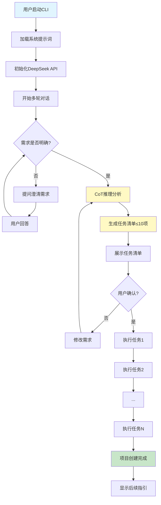

# 产品需求文档 (PRD)

## 1. 项目概述

### 1.1 项目信息
- **项目名称**: AgentCLI - 智能项目初始化助手
- **项目版本**: v0.1.0 (MVP原型)
- **文档版本**: v1.0
- **编写日期**: 2025-11-06
- **项目类型**: CLI工具

### 1.2 项目目标
为初级开发者提供一个智能化的CLI Agent工具，通过自然语言交互和AI推理能力，帮助开发者快速创建规范、完整的项目脚手架，降低项目初始化的门槛和复杂度。

### 1.3 目标用户
- **主要用户**: 初级开发者（0-2年经验）
- **用户特征**: 
  - 对项目结构和最佳实践不够熟悉
  - 需要详细引导和推荐
  - 希望快速开始编码而非花时间配置项目
  - 对命令行工具有基本了解

### 1.4 核心价值
- **降低门槛**: 通过对话式交互，无需记忆复杂的项目配置
- **智能推荐**: 基于AI分析用户需求，推荐最佳技术选型和配置
- **开箱即用**: 生成完整的项目结构，包含所有必要配置和最佳实践
- **学习友好**: 为初级开发者提供解释和引导，帮助理解项目结构

### 1.5 成功指标
- **用户体验**: 从启动到完成项目创建，平均耗时 < 3分钟
- **完整性**: 生成的项目可直接运行和开发，无需额外配置
- **易用性**: 初级开发者无需查看文档即可完成项目创建

## 2. 需求边界与约束

### 2.1 功能边界

**做什么：**
- 通过多轮对话澄清用户的项目需求
- 使用CoT推理分析需求并生成任务清单（≤10项）
- 自动执行任务，创建完整的项目结构
- 支持Python CLI工具和FastAPI Web项目两种模板
- 生成包含代码、配置、README、Git、Docker等完整内容
- 提供友好的命令行界面和进度反馈

**不做什么：**
- 不支持模板之外的其他语言或项目类型（MVP阶段）
- 不实现项目后续的代码生成和修改功能
- 不提供项目管理功能（依赖更新、部署等）
- 不进行代码质量分析或审查
- 不提供GUI界面，仅支持CLI

### 2.2 技术约束

**技术栈要求：**
- **Python版本**: Python 3.10+
- **AI模型**: DeepSeek API（API Key通过.env管理）
- **核心依赖**: 
  - `openai` - DeepSeek API调用（兼容OpenAI SDK）
  - `python-dotenv` - 环境变量管理
  - `click` 或 `typer` - CLI框架
  - `rich` - 美化命令行输出
  - `pydantic` - 数据验证和配置管理

**系统提示词：**
- 存储位置: `systemprompt.md`
- 内容结构: 角色定义 + 交互风格 + 工作流程 + 推理规则
- 可配置: 支持修改和优化

### 2.3 资源约束

**时间约束：**
- 开发周期: 1-2周
- 里程碑: 快速原型验证，优先核心功能可用性

**质量约束：**
- 代码质量: 遵循Python最佳实践（PEP 8）
- 错误处理: 基础的异常处理和用户友好的错误提示
- 日志记录: 基础的操作日志（可选）

### 2.4 业务约束

**用户体验要求：**
- 交互简单明了，每次只问一个问题
- 提供清晰的选项和推荐
- 任务执行有明确的进度反馈
- 错误提示友好且具有指导性

**合规要求：**
- API Key安全存储在.env文件
- 不收集用户隐私数据
- 生成的代码遵循开源许可规范

## 3. 系统架构与核心流程

### 3.1 系统架构概览



### 3.2 核心业务流程


### 3.3 数据流设计

**配置数据流：**
- `.env` → 环境变量加载 → API配置
- `systemprompt.md` → 文本加载 → 系统提示词

**对话数据流：**
- 用户输入 → DeepSeek API → AI响应 → 解析 → 下一轮交互

**任务数据流：**
- 需求信息 → CoT推理 → 任务清单JSON → 任务执行器 → 文件系统操作

## 4. 功能需求 (P0/P1/P2分级)

### P0需求 (核心功能，必须实现)

#### P0-1: 多轮对话交互系统
- **需求描述**: 
  - 作为初级开发者，我希望通过自然语言对话描述项目需求，系统能通过提问逐步澄清我的意图
  - 每次只问一个问题，提供清晰的选项（如A/B/C选择）
  - 支持用户回退和修改之前的回答
  
- **验收标准**:
  - [ ] 系统能识别用户的初始输入并开始提问
  - [ ] 每轮对话只展示一个问题
  - [ ] 提供至少2-3个选项供用户选择
  - [ ] 对话历史被正确记录和传递给AI
  - [ ] 用户可以通过命令（如"返回"）回退到上一个问题

- **依赖关系**: 无

#### P0-2: DeepSeek API集成与CoT推理
- **需求描述**:
  - 系统集成DeepSeek API，使用systemprompt.md中的提示词
  - 在收集足够信息后，使用CoT（Chain of Thought）推理分析用户需求
  - 推理过程包括：需求理解 → 技术选型 → 任务分解
  
- **验收标准**:
  - [ ] 成功加载.env中的API Key
  - [ ] 成功加载systemprompt.md内容
  - [ ] API调用正常，能获得AI响应
  - [ ] CoT推理过程可见（可选展示给用户）
  - [ ] API调用失败时有友好的错误提示

- **依赖关系**: 无

#### P0-3: 任务清单生成与展示
- **需求描述**:
  - 基于CoT推理结果，生成结构化的任务清单
  - 任务数量限制在10项以内
  - 清晰展示每个任务的名称和描述
  - 任务之间有明确的执行顺序
  
- **验收标准**:
  - [ ] 任务清单格式规范（包含序号、任务名、描述）
  - [ ] 任务数量≤10项
  - [ ] 使用Rich库美化输出，易于阅读
  - [ ] 任务有明确的依赖关系和执行顺序
  - [ ] 用户可以在确认前查看完整清单

- **依赖关系**: P0-2

#### P0-4: 任务自动执行引擎
- **需求描述**:
  - 用户确认任务清单后，自动按顺序执行所有任务
  - 实时显示执行进度和状态
  - 每个任务执行成功/失败有明确反馈
  - 如果某个任务失败，提供清晰的错误信息并中止后续任务
  
- **验收标准**:
  - [ ] 支持以下任务类型：
    - 创建目录
    - 生成文件（Python代码、配置文件、README等）
    - 执行命令（git init、安装依赖等）
  - [ ] 实时显示当前执行的任务和进度
  - [ ] 每个任务完成后显示成功或失败标记
  - [ ] 任务失败时停止执行并给出详细错误信息
  - [ ] 支持任务执行的回滚（可选，P1需求）

- **依赖关系**: P0-3

#### P0-5: Python CLI工具项目模板
- **需求描述**:
  - 提供完整的Python CLI工具项目模板
  - 包含基础代码结构、依赖配置、README、测试框架等
  
- **模板内容**:
  ```
  project_name/
  ├── .git/                 # Git仓库
  ├── .gitignore           # Python标准忽略文件
  ├── README.md            # 项目说明文档
  ├── requirements.txt     # 依赖列表
  ├── setup.py             # 安装配置
  ├── project_name/        # 主代码目录
  │   ├── __init__.py
  │   ├── cli.py          # CLI入口（使用Click/Typer）
  │   └── core.py         # 核心逻辑
  ├── tests/              # 测试目录
  │   ├── __init__.py
  │   └── test_core.py
  └── .env.example        # 环境变量示例
  ```

- **验收标准**:
  - [ ] 生成的项目结构完整
  - [ ] 所有Python文件包含基础代码框架
  - [ ] README.md包含项目介绍、安装、使用说明
  - [ ] requirements.txt包含必要依赖
  - [ ] Git仓库已初始化
  - [ ] 生成后可直接运行 `python -m project_name`

- **依赖关系**: P0-4

#### P0-6: FastAPI Web项目模板
- **需求描述**:
  - 提供完整的FastAPI Web项目模板
  - 包含API路由、数据库配置、Docker支持等
  
- **模板内容**:
  ```
  project_name/
  ├── .git/
  ├── .gitignore
  ├── README.md
  ├── requirements.txt
  ├── Dockerfile
  ├── docker-compose.yml
  ├── .env.example
  ├── app/
  │   ├── __init__.py
  │   ├── main.py         # FastAPI应用入口
  │   ├── api/            # API路由
  │   │   ├── __init__.py
  │   │   └── routes.py
  │   ├── core/           # 核心配置
  │   │   ├── __init__.py
  │   │   └── config.py
  │   ├── models/         # 数据模型
  │   │   └── __init__.py
  │   └── db/             # 数据库
  │       ├── __init__.py
  │       └── database.py
  └── tests/
      ├── __init__.py
      └── test_api.py
  ```

- **验收标准**:
  - [ ] 生成的项目结构完整
  - [ ] FastAPI应用可以直接启动
  - [ ] 包含至少一个示例API端点
  - [ ] Docker配置完整可用
  - [ ] README包含API文档和部署说明
  - [ ] 数据库配置支持SQLite（默认）和PostgreSQL（可选）

- **依赖关系**: P0-4

### P1需求 (重要功能)

#### P1-1: 友好的命令行界面
- **需求描述**:
  - 使用Rich库美化CLI输出
  - 支持彩色文本、进度条、表格等
  - 提供清晰的视觉层次和信息组织
  
- **验收标准**:
  - [ ] 使用Rich的Panel展示重要信息
  - [ ] 任务执行时显示Spinner或Progress Bar
  - [ ] 使用颜色区分不同类型的信息（成功/错误/提示）
  - [ ] 任务清单使用Table格式展示

- **依赖关系**: P0-1, P0-3, P0-4

#### P1-2: 配置验证与错误处理
- **需求描述**:
  - 启动时验证.env配置完整性
  - 验证systemprompt.md文件存在且格式正确
  - 提供友好的错误提示和解决建议
  
- **验收标准**:
  - [ ] 缺少.env文件时给出创建指引
  - [ ] API Key无效时给出明确提示
  - [ ] systemprompt.md缺失或格式错误时给出提示
  - [ ] 网络错误时提供重试选项
  - [ ] 所有错误提示包含解决建议

- **依赖关系**: P0-2

#### P1-3: 项目定制化选项
- **需求描述**:
  - 在对话过程中收集定制化需求
  - 支持数据库类型选择（SQLite/PostgreSQL/MySQL）
  - 支持是否包含Docker配置
  - 支持是否包含测试框架
  
- **验收标准**:
  - [ ] 对话流程中询问定制化选项
  - [ ] 根据用户选择生成不同的配置
  - [ ] 选项影响任务清单内容
  - [ ] README中说明用户的选择

- **依赖关系**: P0-1, P0-5, P0-6

#### P1-4: 操作日志记录
- **需求描述**:
  - 记录关键操作到日志文件
  - 包括对话历史、任务执行记录、错误信息
  - 方便调试和问题排查
  
- **验收标准**:
  - [ ] 生成.agentcli/log目录
  - [ ] 每次运行创建带时间戳的日志文件
  - [ ] 记录API调用和响应
  - [ ] 记录任务执行详情
  - [ ] 错误完整堆栈记录到日志

- **依赖关系**: P0-2, P0-4

### P2需求 (增强功能，可后续迭代)

#### P2-1: 交互式命令支持
- **需求描述**:
  - 在对话过程中支持特殊命令
  - 如：`/back`（返回上一步）、`/restart`（重新开始）、`/help`（帮助）
  
- **验收标准**:
  - [ ] 识别并处理特殊命令
  - [ ] `/back`可以返回上一个问题
  - [ ] `/restart`清空历史重新开始
  - [ ] `/help`显示可用命令列表

- **依赖关系**: P0-1

#### P2-2: 任务执行的Dry-run模式
- **需求描述**:
  - 支持`--dry-run`参数
  - 只展示将要执行的操作，不实际创建文件
  - 方便用户预览结果
  
- **验收标准**:
  - [ ] 支持`--dry-run`命令行参数
  - [ ] Dry-run模式下展示所有任务但不执行
  - [ ] 显示将要创建的文件列表和内容摘要

- **依赖关系**: P0-4

#### P2-3: 模板扩展机制
- **需求描述**:
  - 设计可扩展的模板系统
  - 方便后续添加新的项目模板
  - 模板配置与代码分离
  
- **验收标准**:
  - [ ] 模板使用独立的配置文件（YAML/JSON）
  - [ ] 模板内容使用Jinja2或类似模板引擎
  - [ ] 添加新模板无需修改核心代码

- **依赖关系**: P0-5, P0-6

#### P2-4: 任务执行失败的回滚机制
- **需求描述**:
  - 当任务执行失败时，自动回滚已创建的内容
  - 或提供手动清理选项
  
- **验收标准**:
  - [ ] 记录每个任务创建的文件和目录
  - [ ] 失败时询问用户是否回滚
  - [ ] 回滚操作完整清理创建的内容

- **依赖关系**: P0-4

## 5. 非功能需求

### 5.1 性能要求
- **响应时间**: 
  - AI对话响应时间 < 5秒（取决于DeepSeek API）
  - 任务执行时间取决于项目大小，单个文件创建 < 1秒
  
- **资源消耗**:
  - 内存占用 < 100MB
  - CPU占用低，主要等待IO和API响应

### 5.2 安全要求
- **敏感信息保护**:
  - API Key存储在.env文件，不硬编码
  - .env文件加入.gitignore，防止泄露
  - 生成的项目自动包含.env.example
  
- **输入验证**:
  - 验证项目名称，防止路径遍历攻击
  - 验证API响应格式，防止注入攻击

### 5.3 可用性要求
- **易用性**:
  - 首次使用无需阅读文档即可完成项目创建
  - 错误提示清晰且包含解决方案
  - 支持`--help`查看使用说明
  
- **兼容性**:
  - 支持macOS、Linux、Windows
  - Python 3.10+环境
  - 主流终端（Terminal、iTerm2、Windows Terminal等）

### 5.4 可维护性要求
- **代码质量**:
  - 遵循PEP 8编码规范
  - 关键函数包含docstring
  - 代码结构清晰，模块职责分明
  
- **可测试性**:
  - 核心逻辑可单元测试
  - 提供测试用例（至少覆盖核心功能）

## 6. 验收标准

### 6.1 功能验收

**场景1：创建Python CLI项目**
```bash
$ python -m agentcli

欢迎使用 AgentCLI！我将帮助你创建项目。

请问你想创建什么类型的项目？
A) Python CLI 工具
B) Python Web API (FastAPI)

> A

请描述一下这个CLI工具的主要功能？
> 一个文件批量重命名工具

需要支持哪些重命名规则？
A) 基础规则（前缀、后缀、序号）
B) 高级规则（正则表达式、自定义函数）
C) 让AI推荐

> C

[CoT 推理过程...]

我为你生成了以下任务清单：
┏━━━┳━━━━━━━━━━━━━━━━━━┳━━━━━━━━━━━━━━━━━━━━┓
┃ # ┃ 任务             ┃ 描述                ┃
┡━━━╇━━━━━━━━━━━━━━━━━━╇━━━━━━━━━━━━━━━━━━━━┩
│ 1 │ 创建项目目录     │ 创建 file-renamer/  │
│ 2 │ 生成CLI入口      │ 使用Click框架       │
│ 3 │ 实现核心逻辑     │ 基础重命名功能      │
│ 4 │ 生成配置文件     │ setup.py等          │
│ 5 │ 初始化Git仓库    │ git init            │
│ 6 │ 生成README       │ 包含使用说明        │
┗━━━┻━━━━━━━━━━━━━━━━━━┻━━━━━━━━━━━━━━━━━━━━┛

确认执行？(Y/n) > Y

[成功] 创建项目目录 file-renamer/
[成功] 生成CLI入口文件
[成功] 实现核心重命名逻辑
[成功] 生成requirements.txt
[成功] 初始化Git仓库
[成功] 生成README.md

项目创建成功！

下一步：
1. cd file-renamer
2. pip install -r requirements.txt
3. python -m file_renamer --help
```

**场景2：创建FastAPI项目**
```bash
$ python -m agentcli

请问你想创建什么类型的项目？
A) Python CLI 工具
B) Python Web API (FastAPI)

> B

这个API项目的主要用途是什么？
> 博客后端服务

需要数据库支持吗？
A) 需要（SQLite - 简单）
B) 需要（PostgreSQL - 生产环境）
C) 暂时不需要

> A

需要用户认证功能吗？
A) 需要（JWT）
B) 暂时不需要

> B

需要Docker配置吗？
A) 需要
B) 不需要

> A

[生成任务清单并执行...]

项目创建成功！

项目结构：
blog-api/
├── app/
│   ├── main.py (FastAPI应用)
│   ├── api/ (路由)
│   ├── models/ (数据模型)
│   └── db/ (数据库)
├── Dockerfile
├── docker-compose.yml
└── README.md

下一步：
1. cd blog-api
2. docker-compose up -d
3. 访问 http://localhost:8000/docs
```

**验收标准清单**:
- [ ] CLI启动正常，显示欢迎信息
- [ ] 对话流程完整，问题清晰
- [ ] CoT推理输出合理的任务清单
- [ ] 任务执行成功，无错误
- [ ] 生成的项目结构完整
- [ ] 生成的项目可以直接运行

### 6.2 性能验收
- [ ] AI响应时间 < 5秒
- [ ] 单个文件创建 < 1秒
- [ ] 完整项目创建 < 30秒

### 6.3 质量验收
- [ ] 代码遵循PEP 8规范
- [ ] 无明显Bug和崩溃
- [ ] 错误提示友好且有用
- [ ] README文档完整
- [ ] 包含基础单元测试

## 7. 技术实现建议

### 7.1 项目结构
```
agentcli/
├── .env.example              # 环境变量模板
├── .gitignore
├── README.md
├── requirements.txt
├── setup.py
├── systemprompt.md          # 系统提示词
├── agentcli/
│   ├── __init__.py
│   ├── main.py              # CLI入口
│   ├── config.py            # 配置管理
│   ├── conversation.py      # 对话管理
│   ├── ai_client.py         # DeepSeek API客户端
│   ├── task_generator.py    # 任务清单生成
│   ├── task_executor.py     # 任务执行引擎
│   ├── templates/           # 项目模板
│   │   ├── python_cli/
│   │   │   ├── template.yaml
│   │   │   └── files/
│   │   └── fastapi/
│   │       ├── template.yaml
│   │       └── files/
│   └── utils/
│       ├── file_ops.py      # 文件操作
│       └── logger.py        # 日志记录
└── tests/
    ├── test_conversation.py
    ├── test_task_generator.py
    └── test_task_executor.py
```

### 7.2 核心模块设计

#### 7.2.1 对话管理 (conversation.py)
```python
class ConversationManager:
    """管理多轮对话流程"""
    def __init__(self, ai_client, system_prompt):
        self.ai_client = ai_client
        self.system_prompt = system_prompt
        self.history = []
    
    def ask_question(self, question: str) -> str:
        """向用户提问并获取回答"""
        pass
    
    def analyze_intent(self) -> dict:
        """分析用户意图"""
        pass
    
    def is_ready_for_generation(self) -> bool:
        """判断是否收集足够信息"""
        pass
```

#### 7.2.2 任务生成器 (task_generator.py)
```python
class TaskGenerator:
    """基于CoT推理生成任务清单"""
    def __init__(self, ai_client):
        self.ai_client = ai_client
    
    def generate_tasks(self, requirements: dict) -> List[Task]:
        """生成任务清单（≤10项）"""
        pass
    
    def cot_reasoning(self, requirements: dict) -> str:
        """Chain of Thought推理过程"""
        pass
```

#### 7.2.3 任务执行器 (task_executor.py)
```python
class TaskExecutor:
    """执行任务清单"""
    def __init__(self):
        self.executed_tasks = []
    
    def execute(self, tasks: List[Task], show_progress=True):
        """按顺序执行所有任务"""
        pass
    
    def execute_single(self, task: Task) -> bool:
        """执行单个任务"""
        pass
    
    def rollback(self):
        """回滚已执行的任务（P2）"""
        pass
```

### 7.3 DeepSeek API集成
```python
from openai import OpenAI

client = OpenAI(
    api_key=os.getenv("DEEPSEEK_API_KEY"),
    base_url="https://api.deepseek.com"
)

response = client.chat.completions.create(
    model="deepseek-chat",
    messages=[
        {"role": "system", "content": system_prompt},
        {"role": "user", "content": user_input}
    ],
    temperature=0.7,
    max_tokens=2000
)
```

### 7.4 依赖列表 (requirements.txt)
```
openai>=1.0.0           # DeepSeek API (兼容OpenAI SDK)
python-dotenv>=1.0.0    # 环境变量
click>=8.1.0            # CLI框架
rich>=13.0.0            # 美化输出
pydantic>=2.0.0         # 数据验证
pyyaml>=6.0.0           # YAML配置解析 (P1)
jinja2>=3.1.0           # 模板引擎 (P2)
```

## 8. 风险与应对

### 8.1 技术风险

**风险1：DeepSeek API响应质量不稳定**
- 影响：生成的任务清单可能不合理
- 应对：
  - 在systemprompt.md中提供详细的输出格式要求
  - 对AI响应进行验证和修正
  - 提供用户反馈机制，可以重新生成

**风险2：任务执行失败（文件冲突、权限问题等）**
- 影响：项目创建中断，用户体验差
- 应对：
  - 执行前检查目标目录是否存在
  - 捕获异常并提供清晰的错误信息
  - P2实现回滚机制

**风险3：模板维护成本高**
- 影响：随着模板增加，维护工作量大
- 应对：
  - P2实现模板配置化（YAML + Jinja2）
  - 文档化模板结构规范
  - 社区贡献机制（后续）

### 8.2 产品风险

**风险1：对话流程过长，用户失去耐心**
- 影响：用户体验差，放弃使用
- 应对：
  - 控制问题数量（≤5个核心问题）
  - 提供快速模式（使用默认配置）
  - 显示进度（"第2/5个问题"）

**风险2：生成的项目不符合用户预期**
- 影响：用户需要大量修改，失去工具价值
- 应对：
  - 在任务执行前展示清单，让用户确认
  - 生成详细的README，说明项目结构
  - 收集用户反馈，持续优化模板

### 8.3 资源风险

**风险1：1-2周时间不够**
- 影响：功能不完整，质量不达标
- 应对：
  - 严格控制MVP范围，优先P0需求
  - P1和P2需求可以后续迭代
  - 快速原型 → 测试反馈 → 迭代优化

## 9. 后续迭代规划

### V0.2 迭代（P1功能完善）
- 完善错误处理和日志记录
- 增加项目定制化选项
- 优化CLI界面体验

### V0.3 迭代（模板扩展）
- 新增Django、Flask模板
- 新增JavaScript/TypeScript项目支持
- 实现模板配置化机制

### V1.0 正式版
- 完善文档和测试覆盖
- 支持自定义模板
- 社区模板库

---

**文档结束**

