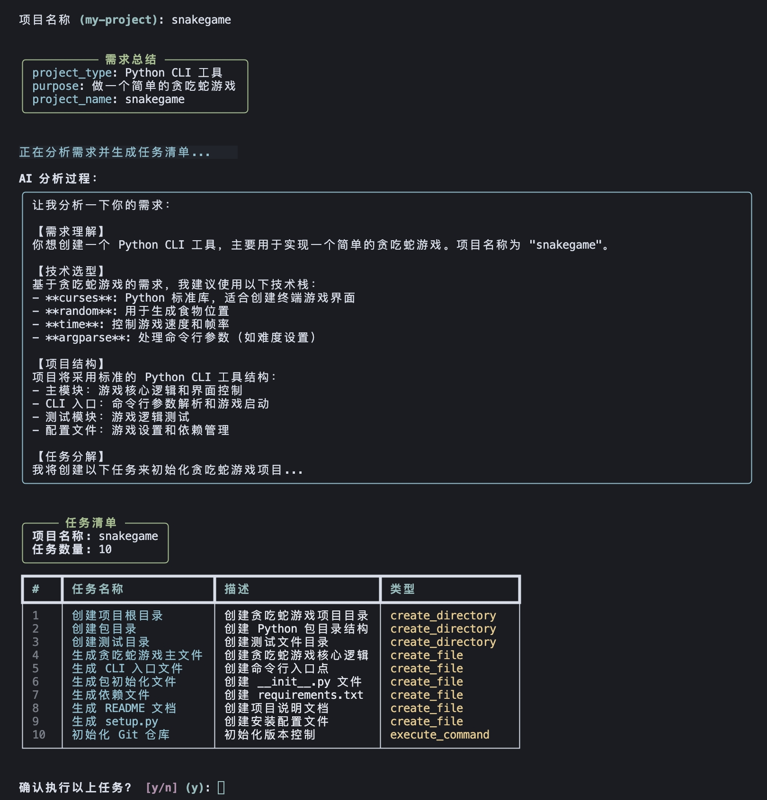
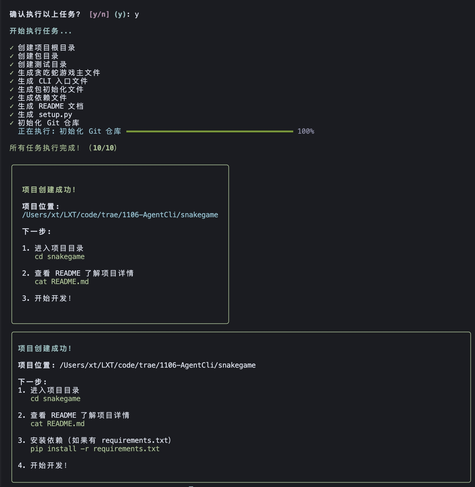
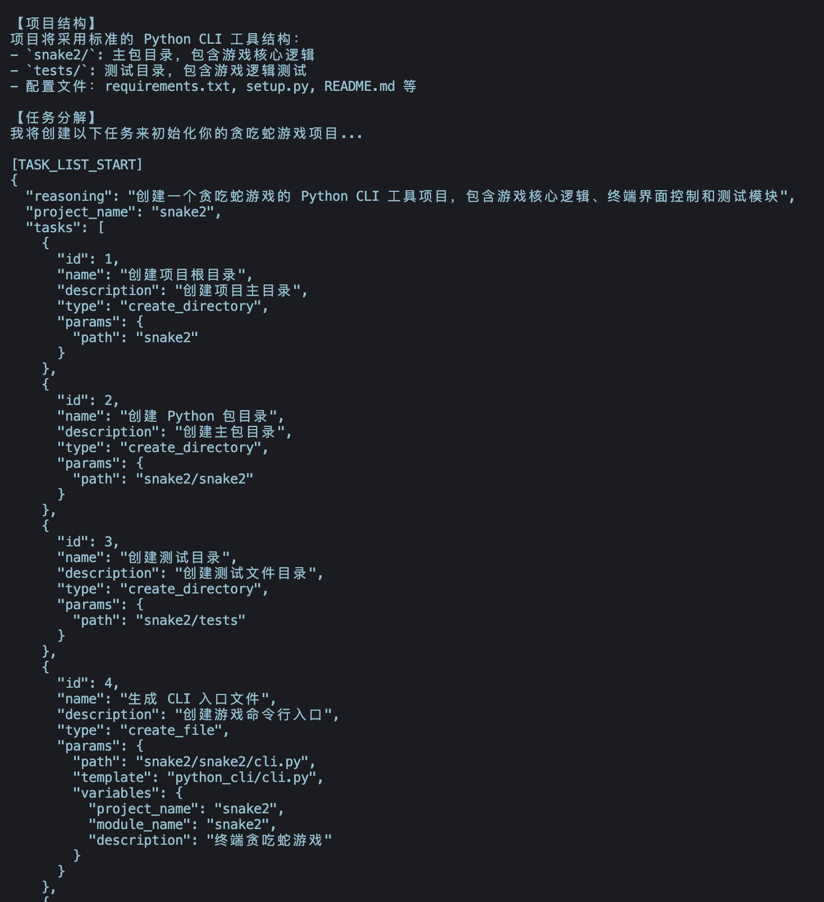
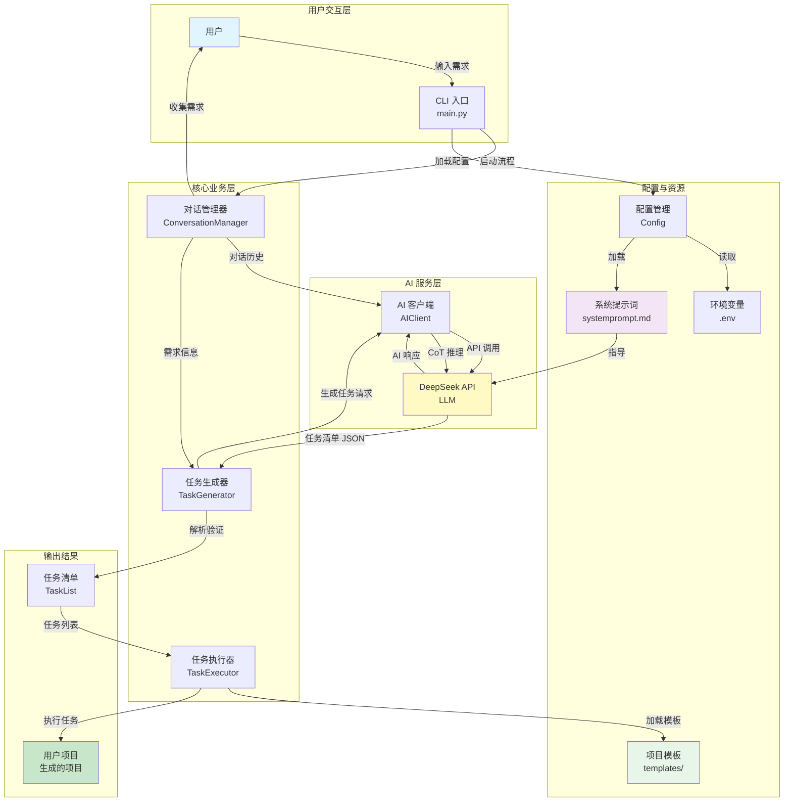
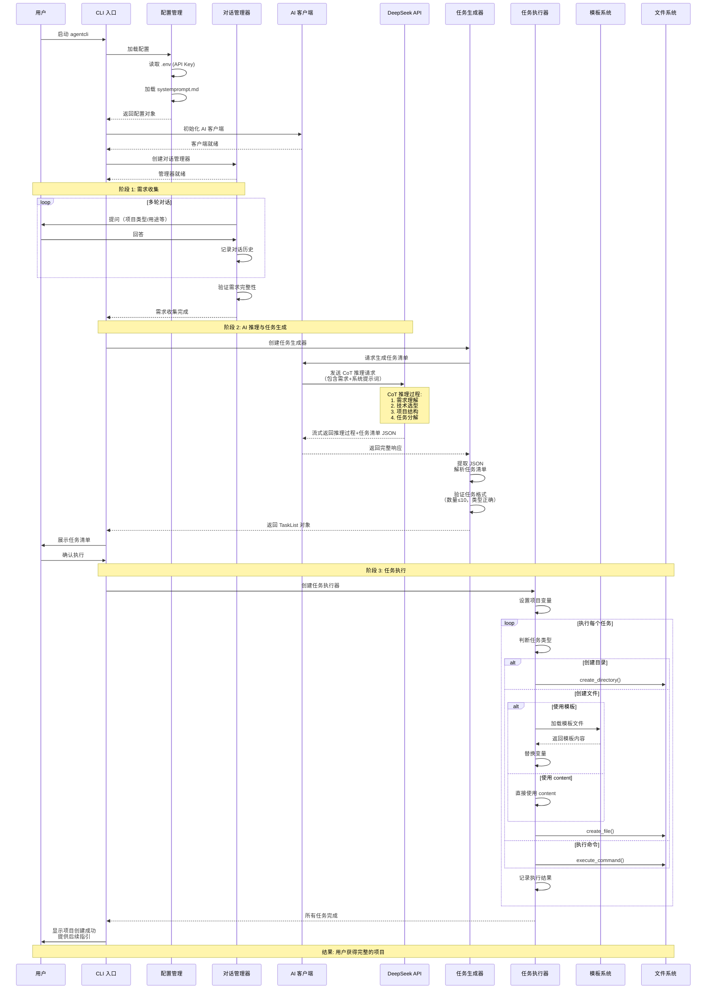

# AgentCLI - 智能项目初始化助手


一个智能化的 CLI Agent 工具，通过自然语言交互和 AI 推理能力，帮助开发者快速创建规范、完整的项目脚手架。

## 界面预览

### 启动界面


### AI 推理过程（流式输出）


### 任务执行与项目创建


## 功能特点

- **多轮对话交互**: 通过友好的对话方式收集项目需求
- **流式输出反馈**: AI 响应实时流式显示，提供更好的交互体验
- **CoT 推理分析**: 使用 Chain of Thought 推理分析用户需求并推荐最佳技术选型
- **智能任务生成**: 自动生成结构化的任务清单（≤10项）
- **自动化执行**: 按顺序自动执行任务，创建完整的项目结构
- **项目模板**: 
  - Python CLI 工具模板
  - FastAPI Web 项目模板

## 安装

### 前置要求

- Python 3.10+
- DeepSeek API Key

### 安装步骤

1. 克隆仓库：
```bash
git clone <repository-url>
cd 1106-AgentCli
```

2. 创建虚拟环境（推荐）：
```bash
python -m venv venv
source venv/bin/activate  # Linux/Mac
# 或
venv\Scripts\activate  # Windows
```

3. 安装依赖：
```bash
pip install -r requirements.txt
```

4. 配置环境变量：
```bash
cp .env.example .env
# 编辑 .env 文件，填入你的 DeepSeek API Key
```

5. 安装 AgentCLI（可选）：
```bash
pip install -e .
```

## 使用方法

### 基本使用

```bash
python -m agentcli
```

或者如果已安装：

```bash
agentcli
```

### 使用流程

1. 启动 AgentCLI
2. 回答一系列关于项目的问题
3. AI 会分析你的需求并生成任务清单
4. 确认任务清单后，自动创建项目
5. 根据提示进入项目目录开始开发

### 示例场景

**创建 Python CLI 工具：**

```bash
$ python -m agentcli

请问你想创建什么类型的项目？
A) Python CLI 工具
B) Python Web API (FastAPI)

> A

请描述一下这个CLI工具的主要功能？
> 文件批量重命名工具

[AI 分析并生成任务清单...]
[自动创建项目...]

项目创建成功！
```

**创建 FastAPI 项目：**

```bash
$ python -m agentcli

请问你想创建什么类型的项目？
A) Python CLI 工具
B) Python Web API (FastAPI)

> B

这个API项目的主要用途是什么？
> 博客后端服务

[AI 分析并生成任务清单...]
[自动创建项目...]

项目创建成功！
```

## 项目结构

```
1106-AgentCli/
├── agentcli/              # 主包
│   ├── __init__.py
│   ├── main.py            # CLI 入口
│   ├── config.py          # 配置管理
│   ├── ai_client.py       # DeepSeek API 客户端
│   ├── conversation.py    # 对话管理
│   ├── task_generator.py  # 任务生成器
│   ├── task_executor.py   # 任务执行引擎
│   ├── templates/         # 项目模板
│   │   ├── python_cli/
│   │   └── fastapi/
│   └── utils/             # 工具函数
│       ├── file_ops.py
│       └── template_loader.py
├── tests/                 # 测试
├── systemprompt.md        # 系统提示词
├── requirements.txt       # 依赖
├── setup.py              # 安装配置
├── .env.example          # 环境变量示例
└── README.md             # 项目文档
```

## 运作机制

AgentCLI 通过多个核心组件协同工作，实现从用户需求到项目创建的完整流程。

### 系统架构拓扑图

以下图表展示了各个组件之间的关系和数据流向：



### 完整流程时序图

以下时序图展示了从用户启动到项目创建的完整执行流程：



### 核心组件说明

#### 1. 对话管理器 (ConversationManager)
- **职责**: 管理多轮对话，收集用户需求
- **输入**: 用户回答
- **输出**: 需求字典、对话历史
- **特点**: 每次只问一个问题，提供 A/B/C 选择

#### 2. 任务生成器 (TaskGenerator)
- **职责**: 基于 AI 推理生成任务清单
- **输入**: 需求信息、对话历史
- **输出**: TaskList 对象（包含 ≤10 个任务）
- **特点**: 使用 CoT 推理，生成结构化的 JSON 任务清单

#### 3. 任务执行器 (TaskExecutor)
- **职责**: 执行任务清单，创建项目文件
- **输入**: TaskList 对象
- **输出**: 完整的项目目录和文件
- **特点**: 支持三种任务类型，自动变量替换，实时进度显示

#### 4. AI 客户端 (AIClient)
- **职责**: 封装 DeepSeek API 调用
- **输入**: 消息列表、系统提示词
- **输出**: AI 响应（支持流式输出）
- **特点**: 自动重试、错误处理、流式显示

#### 5. 模板系统 (Templates)
- **职责**: 提供项目模板文件
- **位置**: `agentcli/templates/`
- **内容**: Python CLI 和 FastAPI 项目模板
- **特点**: 支持变量替换，可扩展

#### 6. 系统提示词 (systemprompt.md)
- **职责**: 指导 AI 的行为和输出格式
- **内容**: 角色定义、工作流程、任务格式要求
- **特点**: 可配置，影响 AI 的推理和代码生成质量

### 数据流向

1. **需求收集阶段**:
   ```
   用户输入 → ConversationManager → 需求字典
   ```

2. **任务生成阶段**:
   ```
   需求字典 + 对话历史 → TaskGenerator → AIClient → DeepSeek API
   → CoT 推理 → JSON 任务清单 → TaskList 对象
   ```

3. **任务执行阶段**:
   ```
   TaskList → TaskExecutor → 模板系统/直接内容 → 文件系统 → 用户项目
   ```

### 关键设计决策

- **流式输出**: AI 响应实时显示，提升用户体验
- **变量自动替换**: 确保所有模板变量被正确替换
- **代码生成**: AI 直接生成实际功能代码，而非仅使用模板
- **任务限制**: 最多 10 个任务，保持清单简洁
- **错误处理**: 每个环节都有完善的错误处理和用户提示

## 开发

### 运行测试

```bash
pytest tests/
```

### 代码规范

项目遵循 PEP 8 编码规范。

## 技术栈

- **Python 3.10+**: 主要开发语言
- **DeepSeek API**: AI 推理和对话
- **Click**: CLI 框架
- **Rich**: 命令行美化
- **Pydantic**: 数据验证

## License

MIT License

## 贡献

欢迎贡献！请查看贡献指南。

## 支持

如有问题，请提交 Issue。

