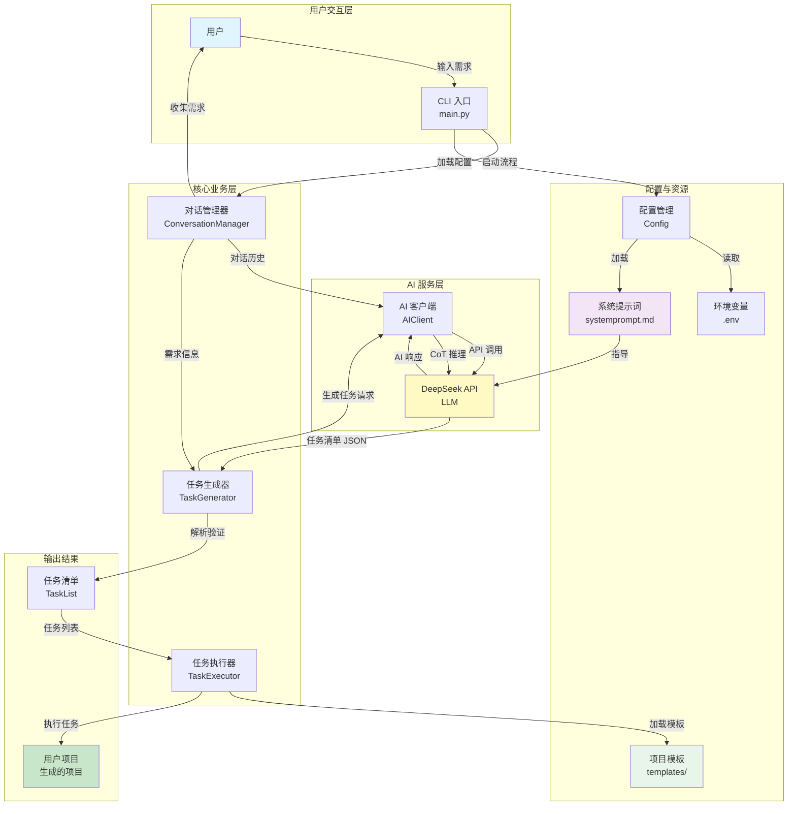
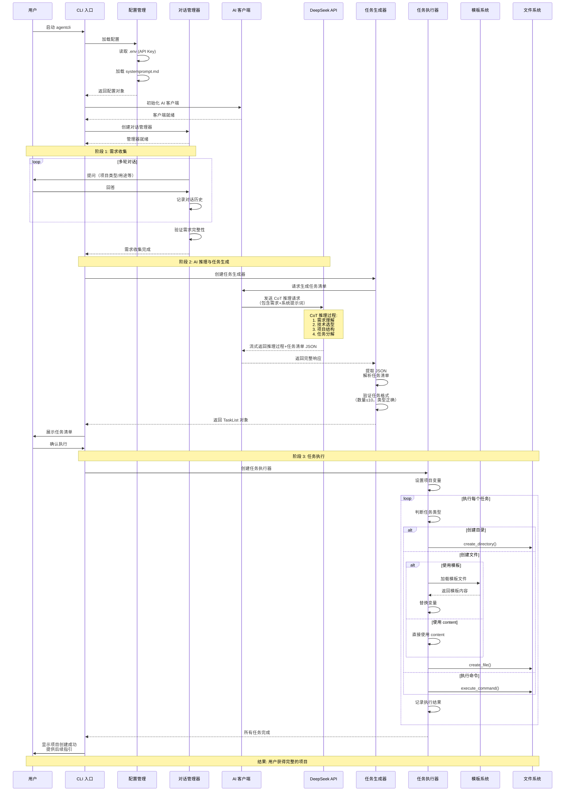

# AgentCLI - 智能项目初始化助手

[](https://www.python.org/downloads/)
[](LICENSE)
[](https://github.com/Coldplay-now/agenticCLI)
[](https://github.com/Coldplay-now/agenticCLI/releases)
[](https://www.deepseek.com/)
[](https://click.palletsprojects.com/)
[](https://github.com/psf/black)

> 一个智能化的 CLI Agent 工具，通过自然语言交互和 AI 推理能力，帮助开发者快速创建规范、完整的项目脚手架。

**AgentCLI** 利用 DeepSeek AI 的强大推理能力，通过对话式交互理解你的项目需求，自动生成完整的项目结构、配置文件和可运行的代码。无论是创建 Python CLI 工具还是 FastAPI Web 应用，只需几分钟即可获得一个开箱即用的项目。

## 界面预览

### 启动界面


### AI 推理过程（流式输出）


### 任务执行与项目创建


## 功能特点

- **多轮对话交互**: 通过友好的对话方式收集项目需求
- **流式输出反馈**: AI 响应实时流式显示，提供更好的交互体验
- **CoT 推理分析**: 使用 Chain of Thought 推理分析用户需求并推荐最佳技术选型
- **智能任务生成**: 自动生成结构化的任务清单（≤10项）
- **自动化执行**: 按顺序自动执行任务，创建完整的项目结构
- **项目模板**: 
  - Python CLI 工具模板
  - FastAPI Web 项目模板

## 快速开始

### 前置要求

- **Python 3.10+** - 确保已安装 Python 3.10 或更高版本
- **DeepSeek API Key** - 获取方式：[DeepSeek 官网](https://www.deepseek.com/)

### 安装步骤

#### 1. 克隆仓库

```bash
git clone https://github.com/Coldplay-now/agenticCLI.git
cd agenticCLI
```

#### 2. 创建虚拟环境（推荐）

```bash
# Linux/Mac
python -m venv venv
source venv/bin/activate

# Windows
python -m venv venv
venv\Scripts\activate
```

#### 3. 安装依赖

```bash
pip install -r requirements.txt
```

#### 4. 配置环境变量

```bash
# 复制环境变量模板
cp .env.example .env

# 编辑 .env 文件，填入你的 DeepSeek API Key
# DEEPSEEK_API_KEY=sk-your-api-key-here
```

> 💡 **提示**: 如果没有 DeepSeek API Key，请访问 [DeepSeek 官网](https://www.deepseek.com/) 注册并获取。

#### 5. 安装 AgentCLI（可选，推荐）

```bash
# 以开发模式安装，可以在任何目录运行 agentcli 命令
pip install -e .
```

安装完成后，你可以在任何目录运行 `agentcli` 命令。

## 使用方法

### 基本使用

**方式一：直接运行（开发模式）**

```bash
# 在项目根目录下
python -m agentcli
```

**方式二：全局命令（推荐）**

```bash
# 如果已安装（pip install -e .）
agentcli
```

### 使用流程

1. **启动 AgentCLI** - 运行 `python -m agentcli` 或 `agentcli`
2. **回答项目问题** - 通过对话方式提供项目信息（类型、用途、名称等）
3. **AI 推理分析** - 系统使用 CoT 推理分析需求，实时显示推理过程（流式输出）
4. **查看任务清单** - AI 生成结构化任务清单（≤10项），展示项目结构
5. **确认并创建** - 确认后自动执行任务，创建完整的项目文件
6. **开始开发** - 根据提示进入项目目录，开始你的开发之旅

### 核心特性

- ✅ **流式输出** - AI 推理过程实时显示，提供更好的交互体验
- ✅ **智能代码生成** - AI 根据项目上下文生成完整、可运行的代码，而非占位符
- ✅ **代码验证** - 自动验证生成代码的语法、导入和包结构
- ✅ **变量自动替换** - 确保所有模板变量被正确替换
- ✅ **错误处理** - 完善的错误提示和恢复机制

### 使用示例

#### 示例 1：创建 Python CLI 工具

```bash
$ python -m agentcli

🤖 AgentCLI - 智能项目初始化助手
━━━━━━━━━━━━━━━━━━━━━━━━━━━━━━━━━━━━━━━━

请问你想创建什么类型的项目？
A) Python CLI 工具
B) Python Web API (FastAPI)

> A

这个 Python CLI 工具的主要用途是什么？
> 文件批量重命名工具

请输入项目名称（用于创建目录）：
> file-renamer

[AI 正在分析需求并生成任务清单...]
━━━━━━━━━━━━━━━━━━━━━━━━━━━━━━━━━━━━━━━━

📋 任务清单：
1. 创建项目目录 file-renamer/
2. 创建包目录 file-renamer/file_renamer/
3. 创建核心模块 file_renamer/core.py
4. 创建 CLI 入口 file_renamer/cli.py
5. 创建配置文件 requirements.txt, setup.py, README.md
...

确认执行？(Y/n): Y

[执行任务...]
✅ 项目创建成功！

📁 项目位置: ./file-renamer
🚀 下一步: cd file-renamer && pip install -e .
```

#### 示例 2：创建 FastAPI 项目

```bash
$ python -m agentcli

> B  # 选择 FastAPI

这个 API 项目的主要用途是什么？
> 博客后端服务

需要数据库支持吗？
A) SQLite（简单项目）
B) PostgreSQL（生产环境）
C) 不需要

> A

需要 Docker 配置吗？
A) 需要
B) 不需要

> A

请输入项目名称：
> blog-api

[AI 推理过程实时显示...]
[生成任务清单并执行...]

✅ 项目创建成功！
```

> 💡 **提示**: 更多使用示例和详细说明，请查看 [QUICKSTART.md](QUICKSTART.md)

## 项目结构

```
agenticCLI/
├── agentcli/                    # 核心包
│   ├── __init__.py              # 包初始化
│   ├── __main__.py              # 模块入口（支持 python -m agentcli）
│   ├── main.py                  # CLI 主入口
│   ├── config.py                # 配置管理（环境变量、API Key）
│   ├── ai_client.py             # DeepSeek API 客户端（流式输出、代码生成）
│   ├── conversation.py          # 对话管理器（多轮交互）
│   ├── task_generator.py        # 任务生成器（CoT 推理）
│   ├── task_executor.py         # 任务执行引擎（文件创建、命令执行）
│   ├── templates/               # 项目模板
│   │   ├── python_cli/          # Python CLI 工具模板
│   │   │   ├── template.yaml    # 模板配置
│   │   │   └── files/           # 模板文件
│   │   └── fastapi/             # FastAPI 项目模板
│   │       ├── template.yaml
│   │       └── files/
│   └── utils/                   # 工具模块
│       ├── __init__.py
│       ├── file_ops.py          # 文件操作（创建、验证路径）
│       ├── template_loader.py   # 模板加载器
│       └── code_validator.py    # 代码验证（语法、导入、包结构）
├── tests/                       # 测试套件
│   ├── test_config.py           # 配置测试
│   ├── test_file_ops.py         # 文件操作测试
│   ├── test_task_generator.py   # 任务生成测试
│   └── test_integration.py      # 集成测试
├── systemprompt.md              # AI 系统提示词（指导 AI 行为）
├── requirements.txt             # Python 依赖
├── setup.py                     # 包安装配置
├── pytest.ini                   # pytest 配置
├── .env.example                 # 环境变量模板
├── .gitignore                   # Git 忽略规则
├── README.md                    # 项目文档（本文件）
├── QUICKSTART.md                # 快速开始指南
├── PRD_AgentCLI_v0.1.0.md      # 产品需求文档
└── pic/                         # 界面截图
    ├── 20251106-163024.jpg      # 启动界面
    ├── 20251106-163040.jpg      # AI 推理过程
    └── 20251106-163045.jpg      # 任务执行
```

## 运作机制

AgentCLI 通过多个核心组件协同工作，实现从用户需求到项目创建的完整流程。

### 系统架构拓扑图

以下图表展示了各个组件之间的关系和数据流向：



### 完整流程时序图

以下时序图展示了从用户启动到项目创建的完整执行流程：



### 核心组件说明

#### 1. 对话管理器 (ConversationManager)
- **职责**: 管理多轮对话，收集用户需求
- **输入**: 用户回答
- **输出**: 需求字典、对话历史
- **特点**: 每次只问一个问题，提供 A/B/C 选择

#### 2. 任务生成器 (TaskGenerator)
- **职责**: 基于 AI 推理生成任务清单
- **输入**: 需求信息、对话历史
- **输出**: TaskList 对象（包含 ≤10 个任务）
- **特点**: 使用 CoT 推理，生成结构化的 JSON 任务清单

#### 3. 任务执行器 (TaskExecutor)
- **职责**: 执行任务清单，创建项目文件
- **输入**: TaskList 对象
- **输出**: 完整的项目目录和文件
- **特点**: 支持三种任务类型，自动变量替换，实时进度显示

#### 4. AI 客户端 (AIClient)
- **职责**: 封装 DeepSeek API 调用
- **输入**: 消息列表、系统提示词
- **输出**: AI 响应（支持流式输出）
- **特点**: 自动重试、错误处理、流式显示

#### 5. 模板系统 (Templates)
- **职责**: 提供项目模板文件
- **位置**: `agentcli/templates/`
- **内容**: Python CLI 和 FastAPI 项目模板
- **特点**: 支持变量替换，可扩展

#### 6. 系统提示词 (systemprompt.md)
- **职责**: 指导 AI 的行为和输出格式
- **内容**: 角色定义、工作流程、任务格式要求
- **特点**: 可配置，影响 AI 的推理和代码生成质量

### 数据流向

1. **需求收集阶段**:
   ```
   用户输入 → ConversationManager → 需求字典
   ```

2. **任务生成阶段**:
   ```
   需求字典 + 对话历史 → TaskGenerator → AIClient → DeepSeek API
   → CoT 推理 → JSON 任务清单 → TaskList 对象
   ```

3. **任务执行阶段**:
   ```
   TaskList → TaskExecutor → 模板系统/直接内容 → 文件系统 → 用户项目
   ```

### 关键设计决策

- **流式输出**: AI 响应实时显示，提升用户体验
- **变量自动替换**: 确保所有模板变量被正确替换
- **代码生成**: AI 直接生成实际功能代码，而非仅使用模板
- **任务限制**: 最多 10 个任务，保持清单简洁
- **错误处理**: 每个环节都有完善的错误处理和用户提示

## 开发指南

### 运行测试

```bash
# 运行所有测试
pytest

# 运行特定测试文件
pytest tests/test_file_ops.py

# 查看测试覆盖率
pytest --cov=agentcli --cov-report=html

# 运行集成测试
pytest tests/test_integration.py -v
```

### 代码规范

- 遵循 **PEP 8** Python 编码规范
- 使用类型提示（Type Hints）
- 函数和类需要文档字符串（Docstrings）
- 代码格式化：推荐使用 `black` 和 `isort`

### 项目开发流程

1. **Fork 项目** - 在 GitHub 上 Fork 本项目
2. **创建分支** - 创建特性分支 (`git checkout -b feature/AmazingFeature`)
3. **提交更改** - 提交你的更改 (`git commit -m 'Add some AmazingFeature'`)
4. **推送分支** - 推送到远程分支 (`git push origin feature/AmazingFeature`)
5. **提交 PR** - 在 GitHub 上提交 Pull Request

### 添加新模板

1. 在 `agentcli/templates/` 下创建新模板目录
2. 创建 `template.yaml` 配置文件
3. 在 `files/` 目录下放置模板文件
4. 更新 `conversation.py` 中的项目类型选项
5. 测试模板生成功能

## 技术栈

### 核心技术

| 技术 | 用途 | 版本要求 |
|------|------|----------|
| **Python** | 主要开发语言 | 3.10+ |
| **DeepSeek API** | AI 推理、代码生成、对话 | - |
| **Click** | CLI 框架，命令解析 | ≥8.1.0 |
| **Rich** | 终端美化（颜色、表格、进度条） | ≥13.0.0 |
| **Pydantic** | 数据验证和模型定义 | ≥2.0.0 |
| **python-dotenv** | 环境变量管理 | ≥1.0.0 |
| **openai** | DeepSeek API 客户端（兼容 OpenAI SDK） | ≥1.0.0 |
| **pytest** | 测试框架 | ≥7.4.0 |

### 核心依赖

```python
# 主要依赖
openai>=1.0.0          # DeepSeek API 客户端
python-dotenv>=1.0.0   # 环境变量管理
click>=8.1.0           # CLI 框架
rich>=13.0.0           # 终端美化
pydantic>=2.0.0        # 数据验证
pyyaml>=6.0.0          # YAML 解析

# 开发依赖
pytest>=7.4.0          # 测试框架
pytest-cov>=4.1.0      # 测试覆盖率
```

## 常见问题 (FAQ)

### Q: 如何获取 DeepSeek API Key？

A: 访问 [DeepSeek 官网](https://www.deepseek.com/) 注册账号，在控制台获取 API Key。

### Q: 支持哪些项目类型？

A: 目前支持：
- Python CLI 工具（基于 Click）
- FastAPI Web 应用

更多模板正在开发中。

### Q: 生成的项目可以直接运行吗？

A: 是的！生成的项目包含完整的代码、配置文件和依赖，通常可以直接运行。对于 Python CLI 项目，需要先执行 `pip install -e .` 安装包。

### Q: 如何自定义项目模板？

A: 在 `agentcli/templates/` 目录下创建新模板，参考现有模板的结构。详见 [开发指南](#开发指南)。

### Q: 任务数量为什么限制在 10 个？

A: 为了保持任务清单的简洁性和可读性。AI 会自动合并相似任务（如多个文件、多个目录）。

### Q: 生成的代码质量如何保证？

A: AgentCLI 集成了代码验证功能：
- 语法验证（使用 `ast.parse`）
- 导入验证（检查模块是否存在）
- 包结构检查（`__init__.py`、`__main__.py`、`setup.py`）
- Markdown 代码块清理

### Q: 遇到错误怎么办？

A: 
1. 检查 `.env` 文件中的 API Key 是否正确
2. 确保 Python 版本 ≥ 3.10
3. 查看错误信息中的详细提示
4. 提交 [Issue](https://github.com/Coldplay-now/agenticCLI/issues) 获取帮助

更多问题请查看 [QUICKSTART.md](QUICKSTART.md) 或提交 Issue。

## 路线图

- [ ] 支持更多项目模板（Django、Flask、React 等）
- [ ] 支持自定义模板导入
- [ ] 项目代码增量更新功能
- [ ] 代码质量分析集成
- [ ] 多语言支持（英文、日文等）
- [ ] Web UI 界面

## 贡献

我们欢迎所有形式的贡献！

- 🐛 **报告 Bug** - 在 [Issues](https://github.com/Coldplay-now/agenticCLI/issues) 中报告问题
- 💡 **提出建议** - 分享你的想法和改进建议
- 📝 **改进文档** - 帮助完善文档和示例
- 🔧 **提交代码** - Fork 项目并提交 Pull Request

### 贡献者

感谢所有为这个项目做出贡献的开发者！

## 许可证

本项目采用 [MIT License](LICENSE) 许可证。

## 相关链接

- 📖 [快速开始指南](QUICKSTART.md)
- 📋 [产品需求文档](PRD_AgentCLI_v0.1.0.md)
- 🐛 [问题反馈](https://github.com/Coldplay-now/agenticCLI/issues)
- 💬 [讨论区](https://github.com/Coldplay-now/agenticCLI/discussions)
- 🌟 [Star 本项目](https://github.com/Coldplay-now/agenticCLI)

## 致谢

- [DeepSeek](https://www.deepseek.com/) - 提供强大的 AI 能力
- [Click](https://click.palletsprojects.com/) - 优秀的 CLI 框架
- [Rich](https://github.com/Textualize/rich) - 美观的终端输出

---

<div align="center">

**如果这个项目对你有帮助，请给一个 ⭐ Star！**

Made with ❤️ by [Coldplay-now](https://github.com/Coldplay-now)

</div>

